# 📊 Candy Candy – Impacto cultural en las tendencias de nombres

Este proyecto explora si la emisión del anime *Candy Candy* en España durante la década de 1980 influyó en la disminución del uso del nombre “Susana”. Se comparan los patrones en España, donde se transmitió el anime, y en Uruguay, donde no se emitió. Mediante visualizaciones, procesamiento de datos y narrativa cultural, se explora cómo los medios pueden afectar decisiones personales como el nombre de una hija.

---

## 🎯 ¿Qué queremos saber?

> ¿Puede la exposición a una historia de ficción alterar la percepción de un nombre propio?

La historia de Susana en *Candy Candy* marcó emocionalmente a muchas niñas. Este proyecto indaga si su papel como antagonista contribuyó al descenso del nombre en España, en contraste con Uruguay.

---

## 📦 Estructura del proyecto

```
candy-names-impact/
├── data/
│   └── processed/
│       ├── [nombres].csv
│       ├── frecuencia_espana.csv
│       └── frecuencia_uruguay.csv
├── outputs/
│   ├── plots/
│   └── tables/
├── scripts/
│   ├── 01_preparar_datos_espana.py
│   ├── 02_frecuencia_absoluta.py
│   ├── 03_frecuencia_relativa.py
│   ├── 04_graficas_espana.py
│   ├── 05_graficas_uruguay.py
│   └── 06_generar_tablas_md.py
```

---

## 🔁 Pipeline EDA

```mermaid
graph TD
    A[Datos crudos: .csv por nombre y país]--> B[Preparar datos por década]
    B --> C[Frecuencia absoluta\nde cada país]
    C --> D[Frecuencia relativa\nde cada país]
    D --> E[Gráficas Seaborn]
    E --> F[Tablas Markdown]
    F --> G[Infografía y Repo]
    
```



---

## 🚀 Cómo empezar

Instala dependencias:

```bash
pip install pandas matplotlib seaborn
```

Ejecuta los scripts en orden:

```bash
python scripts/01_preparar_datos_espana.py
python scripts/02_frecuencia_absoluta.py
python scripts/03_frecuencia_relativa.py
python scripts/04_graficas_espana.py
python scripts/05_graficas_uruguay.py
python scripts/06_generar_tablas_md.py
```
o revisa el Jupyter Notebook
[](./Candy_Candy_EDA_Report.ipynb)

---

## 📊 Hallazgos clave

- En España, **Susana** muestra un descenso **abrupto** y sostenido.
- En Uruguay, **Susana** presenta un descenso **leve y constante** desde una frecuencia baja.
- **María** crece de forma sostenida y domina en ambos países.
- La comparación sugiere una posible influencia mediática localizada.

---

## 📚 Fuentes consultadas

- [Wikipedia - Candy Candy](https://es.wikipedia.org/wiki/Candy_Candy)
- [Hugo Zapata – Candy Candy, culebrón épico del anime](https://www.hugozapata.com.ar/2013/05/candy-candy-epico-culebron-del-anime/)
- [Medios y percepción social – Soriano Bañuls & Santiago de Jesús (PDF)](https://rua.ua.es/dspace/bitstream/10045/143966/1/Medios_de_comunicacion_y_su_narrativa_ante_los_problema_Soriano_Banuls_Mario.pdf)
- [Let’s Anime – Candy Candy y su legado cultural](https://letsanime.blogspot.com/2014/07/its-candy-candys-world-were-just-living.html)
- [LiveJournal – Susana como personaje odiado](https://hated-character.livejournal.com/248952.html)

---

## 👩‍💻 Autora

**Blanca Vargas**  
*Creadora de contenido con datos, IA aplicada y educación*  
Sitio web: [blancavg.com](https://blancavg.com)  
GitHub: [@blancavg](https://github.com/blancavg)

---

## 📄 Licencia

[Licencia MIT](LICENSE)
