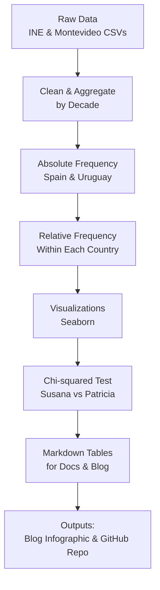

# 📊 Candy Names Impact

> Cultural signals in name trends: How the anime *Candy Candy* may have influenced the decline of "Susana"

[](./Candy_Candy_EDA_Report.ipynb)

This project investigates whether the 1980s anime *Candy Candy* influenced naming trends—specifically, the decline in the name **"Susana"**. We explore the hypothesis using open name frequency datasets from Spain and Uruguay.

## 🔍 Key Questions

- Did the popularity of *Candy Candy* coincide with a measurable shift in naming trends?
- Is the decline in the name *Susana* statistically significant compared to other names from the show (e.g., Ana, Patricia)?
- Are similar declines visible in countries without strong exposure to the show?

## 🚀 Try it yourself

### Requirements

```bash
pip install -r requirements.txt
```

### Run the analysis

```bash
# Run step-by-step scripts
python scripts/01_cargar_datos_espana.py
python scripts/02_cargar_datos_uruguay.py
...

# Or open the final summary notebook
jupyter notebook Candy_Candy_EDA_Report.ipynb
```

## 📂 Repository Structure

```
candy-names-impact/
├── data/
│   ├── raw/           # Original datasets from INE and Montevideo
│   └── processed/     # Cleaned, aggregated data by decade
├── outputs/
│   ├── plots/         # Visualizations
│   └── tables/        # Final absolute/relative frequency tables
├── scripts/           # Modular Python scripts (cleaning, analysis, plotting)
├── Candy_Candy_EDA_Report.ipynb  # Summary notebook
└── README.md          # Project documentation
```

## 📈 EDA Pipeline



## 🙋 Author

**Blanca Vargas**  
[blancavg.com](https://blancavg.com)  


## 🪪 License

This project is open-sourced under the MIT License. Feel free to explore, adapt, and credit.

---

💡 Want to replicate or build on this project?  
Fork it, explore the notebook, or remix it into your own cultural dataset analysis.
