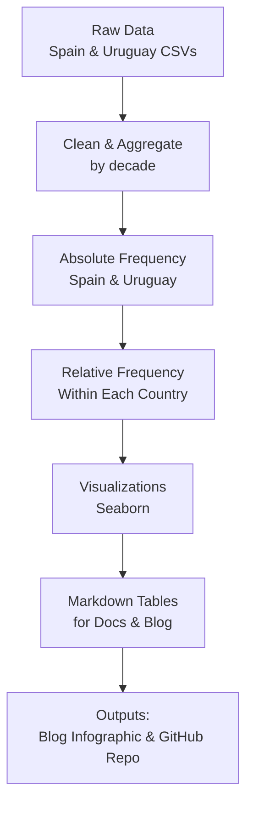

[Versión en español](README.es.md)

# 📊 Candy Candy – Cultural impact on name trends


This project explores whether the broadcast of the anime *Candy Candy* in Spain during the 1980s influenced a decline in the popularity of the name “Susana.” The analysis compares this trend with Uruguay, a country where the anime was not aired. Through data exploration, visualization, and narrative framing, this repository documents how media may shape personal decisions like naming children.

## 🔍 Key Questions

- Did the popularity of *Candy Candy* coincide with a measurable shift in naming trends?
- Is the decline in the name *Susana* statistically significant compared to other names from the show (e.g., Ana, Patricia)?
- Are similar declines visible in countries without strong exposure to the show?

## 🚀 Try it yourself

### Requirements

```bash
pip install -r requirements.txt
```

### Run the pipeline

Execute the scripts in the following order:

```bash
# Run step-by-step scripts
python scripts/01_preparar_datos_espana.py
python scripts/02_frecuencia_absoluta.py
python scripts/03_frecuencia_relativa.py
python scripts/04_graficas_espana.py
python scripts/05_graficas_uruguay.py
python scripts/06_generar_tablas_md.py
```
or open the summary notebook

[](./Candy_Candy_EDA_Report.ipynb)


## 📂 Repository Structure

```
candy-names-impact/
├── data/
│   ├── raw/           # Original datasets from INE and Montevideo
│   └── processed/     # Cleaned, aggregated data by decade
├── outputs/
│   ├── plots/         # Visualizations
│   └── tables/        # Final absolute/relative frequency tables
├── scripts/           # Modular Python scripts (cleaning, analysis, plotting)
├── Candy_Candy_EDA_Report.ipynb  # Summary notebook
└── README.md          # Project documentation
```

## 📈 EDA Pipeline


## 📊 Key Findings

- In Spain, **Susana** experienced an abrupt decline in relative frequency after the 1970s.
- In Uruguay, where *Candy Candy* did not air, the decline of **Susana** was minimal and consistent, with no disruption.
- **María** showed consistent growth across both countries, dominating name choices.
- This suggests a potential cultural effect of media narratives on naming trends.

---

## 📚 References

- [Wikipedia - Candy Candy](https://es.wikipedia.org/wiki/Candy_Candy)
- [Candy Candy: Épico culebrón del anime – Hugo Zapata](https://www.hugozapata.com.ar/2013/05/candy-candy-epico-culebron-del-anime/)
- [Media and Perception of Social Problems – Soriano Bañuls & Santiago de Jesús (PDF)](https://rua.ua.es/dspace/bitstream/10045/143966/1/Medios_de_comunicacion_y_su_narrativa_ante_los_problema_Soriano_Banuls_Mario.pdf)
- [Let’s Anime – It’s Candy Candy’s World](https://letsanime.blogspot.com/2014/07/its-candy-candys-world-were-just-living.html)
- [LiveJournal – Susana as a hated character](https://hated-character.livejournal.com/248952.html)


## Author

**Blanca Vargas**  
*Data-to-Content Creator, Applied AI, and Educator*  
Website: [blancavg.com](https://blancavg.com)  
GitHub: [@blancavg](https://github.com/blancavg)

## 🪪 License

This project is open-sourced under the MIT License. Feel free to explore, adapt, and credit.

---

💡 Want to replicate or build on this project?  
Fork it, explore the notebook, or remix it into your own cultural dataset analysis.
